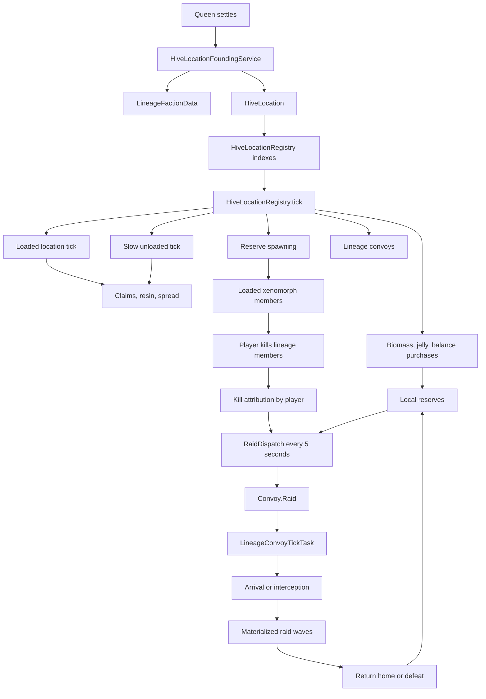

# Hive and Raid System Map

This document maps the current hive and raid implementation as it exists in code. It is a behavior map, not a design proposal.

## Main Concepts

The current system is centered on fixed hive settlements, not one global hive object.

- **Variant faction**: one BLib faction per alien variant. Created by `VariantFactionRegistry`.
- **Lineage faction**: one queen bloodline in one dimension. Stored as `LineageFactionData`.
- **Hive location**: one fixed settlement owned by exactly one lineage. Stored as `HiveLocation`.
- **Location faction**: a BLib faction backing one `HiveLocation`, used for ownership, territory, and UI integration.
- **Reserves**: abstract, unloaded population held by a location. Reserves can later materialize as entities.
- **Convoy**: abstract traveling population between places or toward a player. Subtypes are reinforcement, migration, and raid.
- **Raid**: a convoy subtype that hunts a player after that player kills enough lineage members.

## Core Files

- `common/src/main/java/com/alien/common/gameplay/hive/location/HiveLocation.java`
- `common/src/main/java/com/alien/common/gameplay/hive/location/HiveLocationRegistry.java`
- `common/src/main/java/com/alien/common/gameplay/hive/faction/LineageFactionData.java`
- `common/src/main/java/com/alien/common/gameplay/hive/lifecycle/HiveLocationFoundingService.java`
- `common/src/main/java/com/alien/common/gameplay/hive/tick/HiveLocationLoadedTickTask.java`
- `common/src/main/java/com/alien/common/gameplay/hive/tick/HiveLocationSlowTickTask.java`
- `common/src/main/java/com/alien/common/gameplay/hive/tick/LineageConvoyTickTask.java`
- `common/src/main/java/com/alien/common/gameplay/hive/convoy/Convoy.java`
- `common/src/main/java/com/alien/common/gameplay/hive/convoy/RaidDispatch.java`
- `common/src/main/java/com/alien/common/gameplay/hive/convoy/ConvoyArrival.java`
- `common/src/main/java/com/alien/common/gameplay/hive/convoy/ConvoyInterception.java`
- `common/src/main/java/com/alien/common/gameplay/hive/convoy/RaidWaveProfile.java`
- `common/src/main/java/com/alien/common/gameplay/hive/config/HiveConfig.java`

## Persistent State

### LineageFactionData

`LineageFactionData` is the on-disk parent for a bloodline. It stores:

- variant and parent variant faction id
- dimension
- founder queen id
- empress id
- lineage age
- pending empress emergence flag
- monotonic lineage and location numbering
- all nested `HiveLocation` records
- in-flight convoys
- kill attribution by player for raid dispatch
- lineage kill credit player id
- removal reason

Locations are persisted inside the lineage faction NBT. `HiveLocationRegistry` rebuilds its indexes from those lineage records at server start.

### HiveLocation

`HiveLocation` is the per-settlement state object. It stores:

- location id and owning lineage faction id
- dimension and fixed center position
- founder id
- age and growth timing fields
- claimed chunks, claim timestamps, and decorated chunks
- biomass, royal jelly, scourge jelly, and jelly accumulators
- reproductive-established flag
- local reserves
- known and loaded members by entity type
- local leader snapshot and leadership manager
- boss bar manager
- vent manager
- combat respite counters
- queenless maturation state
- removal reason

The location center never moves. The active hive slab is the founding Y through `centerY + 16`, with 2 blocks of tolerance above and below.

## Registry and Indexes

`HiveLocationRegistry.INSTANCE` owns runtime lookup indexes:

- `byId`: location id to `HiveLocation`
- `byLineage`: lineage faction id to location ids
- `byChunk`: dimension plus chunk to location id
- `byCenterDim`: spatial bucket index for nearest-location queries

These are not persisted. `rebuildFromFactions()` clears and rebuilds them from all loaded lineage factions, then backfills names and cleans orphan location factions.

`validate()` repairs drift in chunk and spatial indexes, removes orphan location factions, and ensures each location has its BLib location faction.

## Server Tick Order

`HiveLocationRegistry.tick(server)` is the main tick entry point. Current order:

1. For every alive registered location:
   - increment location age
   - run `HiveLocationLoadedTickTask`
2. Run `LineageConvoyTickTask` every tick.
3. Run bounded `HiveLocationSlowTickTask`.
4. Tick `EmpressEmergenceRitual`.
5. Scan location dormancy.
6. Scan lineage death.
7. Produce jelly.
8. Run hive population balance purchases.
9. Periodically run loaded hive reserve spawning.
10. Every 5 seconds:
    - dispatch reinforcements
    - dispatch migrations
    - dispatch raids
    - start empress emergence
11. Every `lineageScanIntervalTicks`:
    - decay population pressure
    - run lineage invariants and lifecycle scans

## Founding Flow

Queen founding is handled by `HiveLocationFoundingService`.

### New lineage

`foundNewLineage(queen, position)`:

1. Gets or creates the queen variant faction.
2. Creates a new lineage faction id.
3. Applies lineage faction aesthetics and name.
4. Stores variant, parent variant faction id, dimension, and founder id.
5. Mints the first `HiveLocation`.
6. Registers the location.
7. Ensures the BLib location faction.
8. Claims the initial core chunks around the center.
9. Adds the queen to lineage and location membership.

### New location in existing lineage

`foundNewLocation(queen, lineageFactionId, position)`:

1. Finds the existing lineage.
2. Mints and registers a new `HiveLocation`.
3. Claims initial chunks.
4. Adds queen membership.
5. If the lineage now has at least 2 locations and no empress, sets `pendingEmpressEmergence`.

## Loaded Location Tick

`HiveLocationLoadedTickTask.run(server, location)`:

1. Resolves the owning lineage.
2. Calls `location.tick(server, lineage)`, which:
   - decays combat respite
   - picks the best local leader from loaded members
   - lazy-creates and ticks the boss bar
3. If no claimed chunk is loaded, exits.
4. Periodically runs territory aggro.
5. If a player is near, runs loaded biomass income.
6. Every second, runs:
   - `CatchUpEngine.catchUpTo`
   - `AbstractSpreadAttempt.tryRun`

Loaded-location behavior is therefore responsible for visible boss bars, local leader tracking, biomass from loaded activity, claim catch-up, and abstract spread attempts.

## Slow Location Tick

`HiveLocationSlowTickTask` is a shuffled, bounded scheduler. It samples `slowPathLocationUpdatesPerTick` living locations per tick. It skips locations that already have loaded claimed chunks.

For unloaded candidates, it can run:

- `CatchUpEngine.catchUpUnloadedTo`
- `AbstractSpreadAttempt.tryRun`

This is how unloaded hives still make bounded progress without sweeping every location at once.

## Growth, Claims, and Spread

Growth work is split across:

- `CatchUpEngine`
- `HiveLocationClaims`
- `ContestResolutionTask`
- `PopulationPressureDecayTask`
- `AbstractSpreadAttempt`
- `ChunkPicker`
- `ResinDecorator`

At a high level:

1. A location accumulates biomass through loaded and unloaded income.
2. Claim attempts spend biomass and add chunks to the location.
3. Chunk claims update:
   - the location's `claimedChunks`
   - `HiveLocationRegistry.byChunk`
   - BLib territory claims
4. Decoration/resin density catches up over time.
5. Abstract spread can create additional locations for a lineage when population and spacing rules allow it.
6. Contest and lifecycle tasks clean up conflicts, dormancy, dead locations, and dead lineages.

Important config gates include:

- `perLocationClaimCooldownTicks`
- `maxChunksPerLocation`
- `maxChunksPerLineage`
- `maxClaimsPerScan`
- `baseChunkCost`
- `growthFactor`
- `minimumPopulationRatioForClaiming`
- `minimumHiveLocationDistanceChunks`
- `maxLocationsPerLineage`
- `minimumPopulationForHiveSpread`

## Economy and Reserves

### Biomass

Biomass is the main spendable hive resource. It is used for chunk growth, resin spread, ovipositor creation, and unit purchases.

Loaded biomass sources include:

- loaded xenomorphs
- non-alien kills
- resin block placement
- ovomorphs
- empress presence
- idle bonus

Unloaded biomass sources include:

- base income per claimed chunk
- empress bonus

### Jelly

`JellyProduction.scanAndProduce(server)` runs every tick.

- Queens produce royal jelly over `royalJellyTicksPerProduction`.
- Queens produce rare scourge jelly over `scourgeJellyTicksPerQueenProduction`.
- Harbingers produce scourge jelly over `scourgeJellyTicksPerHarbingerProduction`.

### Population balance

`HiveBalanceTask.scanAll(server)` runs every tick.

For each alive location:

1. Count loaded members plus reserves by caste.
2. Compute population cap as `populationPerChunk * claimedChunks`.
3. Require at least one queen.
4. If under cap, buy net-new basic units, usually runners or drones.
5. If at cap, upgrade composition toward desired caste ratios.

Queen-founded hives do not buy population until `reproductiveEstablished` is true. This protects founding biomass for ovipositor creation.

Harbinger purchases are guarded so a location does not create another harbinger while one from that source is away in a raid.

Purchase data is loaded by `HiveUnitPurchaseReloadListener` into `HiveUnitPurchaseRegistry` from `hive_unit_purchases` JSON.

## Spawning and Materialization

There are two related ideas:

- **Reserve spawning**: location reserves become loaded xenomorphs in/near a loaded hive.
- **Convoy materialization**: abstract convoy members spawn when a convoy arrives or is intercepted.

Reserve spawning is driven periodically by `HiveLoadedSpawner.scanAndSpawn(server)` according to:

- `hiveSpawnerIntervalTicks`
- `hiveSpawnerMinimumLoadedXenomorphs`
- `hiveSpawnerMaxSpawnAttemptsPerLocation`
- `hiveSpawnerMaxSpawnsPerLocation`
- `reserveSpawnsCanIgnoreResin`

Spawn gating checks claimed chunks, vertical slab, population/reserve availability, and hive-layer tags.

## Membership

Hive membership is mostly BLib faction membership plus per-location tracking.

When a member is added to a lineage:

1. `LineageFactionData.onMemberAdded(member, entity)` checks that the entity variant matches the lineage.
2. If it mismatches, the entity is evicted from the faction.
3. If it matches and is loaded inside an owned location chunk, it is added to:
   - `loadedMembersByType`
   - `knownMembersByType`

When a member unloads, its UUID is removed from loaded member maps. Known member maps remain as persisted history.

Aliens also interact with hives in `common/src/main/java/com/alien/common/gameplay/entity/living/alien/Alien.java`:

- fresh spawns can auto-join variant, lineage, and location membership
- spawns inside claimed chunks can consume reserves
- despawned hive-owned xenomorphs can return to reserves
- kills by players are attributed to lineages for raids
- empress death clears lineage empress state

## Convoys

`Convoy` is a sealed interface with three subtypes.

### Common convoy fields

Every convoy has:

- convoy id
- lineage faction id
- dimension
- current abstract position
- composition reserves
- materialized member UUIDs
- dispatched tick

`LineageFactionData` persists active convoys using `ConvoyCodec`.

### Reinforcement

Source location sends surplus reserves to a sister location. On arrival, composition is poured into destination reserves. If the destination is gone, the convoy returns to source if possible.

### Migration

A doomed location evacuates members and optional biomass to another location. On arrival, members and biomass are delivered. Empress-carrying migration currently logs the empress payload; full respawn behavior is noted as later-phase work in code.

### Raid

A player-hunting counterattack. Raid-specific state includes:

- source location id
- target player id
- last known target position
- warning-issued flag
- next wave index
- active wave index and active wave initial count
- wave break start tick
- return-home state
- return-home reason
- return location and position

Raids have exactly 5 waves (`Convoy.Raid.WAVE_COUNT`).

## Raid Trigger Flow

Player kills are recorded per lineage in `LineageFactionData.killAttributionByPlayer`.

Automatic raid dispatch runs every 5 seconds through `RaidDispatch.scanAndDispatch(server)`:

1. Iterate living lineage factions.
2. Skip lineages without an empress.
3. Count each player's recent kills inside `raidAggroWindowTicks`.
4. Require at least `raidThresholdKills`.
5. Require the target player to be online in the lineage dimension.
6. Skip if that lineage already has an outbound raid against the player.
7. Pick the largest eligible source location.
8. Source must have at least `raidMinLocationSizeChunks`.
9. Source must not be inside `perSourceRaidCooldownTicks`.
10. Source reserves must satisfy the active raid wave profile.
11. Drain all 5 waves worth of composition from source reserves.
12. Add a `Convoy.Raid` to the lineage.
13. Clear kill attribution for that player.

Admin-triggered raids use `RaidDispatch.forceRaid(...)`, which forces a raid against a target from the lineage's largest eligible location without requiring the kill threshold.

## Raid Wave Profiles

Raid composition comes from `RaidWaveProfile`.

Profiles are datapack-driven under:

- `data/avp_alien/raid_wave_profiles`

Data generation lives in:

- `fabric/src/main/java/com/alien/fabric/data/raid_wave/RaidWaveProfileDataProvider.java`

The registry is:

- `common/src/main/java/com/alien/common/registry/RaidWaveProfileRegistry.java`

Each profile must define exactly 5 waves. Each wave has:

- `size`
- `buffer_ticks`
- optional guaranteed selections
- random pools

Pool entries select either one entity type or an entity tag, with weight and max count.

The fallback profile uses these wave sizes:

- Wave 1: 5
- Wave 2: 8
- Wave 3: 13
- Wave 4: 21
- Wave 5: 34

Each wave must have at least 5 members. Guaranteed counts cannot exceed the wave size. Random pools must exist unless guarantees fill the wave.

## Raid Tick Flow

Every tick, `LineageConvoyTickTask.run(server)` processes active convoys.

For raids:

1. If returning home and the reason was target unavailable, the raid can resume if the target becomes valid again.
2. If outbound, determine whether the raid should return home:
   - target died: return because `TARGET_DEFEATED`
   - target became creative/spectator: return because `TARGET_UNAVAILABLE`
   - offline target currently does not force return
3. Missing materialized members can be returned into convoy composition.
4. If composition and materialized members are both empty, grant defeat-raid advancement and remove the raid.
5. If outbound:
   - update last known target position if target is online, alive, same dimension
   - refresh the target's Marked for Death effect
   - warn the target when arrival is within 60 seconds
   - grant lead-raid-to-enemy-hive advancement if applicable
   - start wave break if a wave ended and reserves remain
6. Move the convoy with `ConvoyTravel.tick`.
7. Return materialized members that drift too far from the convoy.
8. Check arrival.
9. Tick convoy boss bars.
10. Try interception.

Raid speed is `convoySpeedBlocksPerSecond * raidSpeedMultiplier`.

## Raid Arrival and Waves

`ConvoyArrival.checkArrival(...)` compares convoy distance to target against `arrivalRadiusBlocks`.

For outbound raids:

1. If the raid dimension is unavailable, it holds in flight.
2. If materialized members are still alive, it does not spawn another wave.
3. Otherwise it calls `ConvoyMaterialization.spawnNextRaidWave(...)`.
4. Spawned raiders target the raid target player when available.
5. The raid convoy remains alive after spawning. It only ends when all composition and materialized members are gone, or when it returns home.

Wave pacing is controlled by each wave's `buffer_ticks`.

When a materialized wave is cleared:

1. `raid.shouldStartWaveBreak()` becomes true.
2. `startWaveBreak(currentTick)` records the pause.
3. `canSpawnWave(currentTick, bufferTicks)` becomes true after the buffer expires.
4. The next arrival/interception spawn can materialize the next wave.

## Raid Interception

`ConvoyInterception.tryIntercept(...)` checks for a non-creative, non-spectator, alive player within `convoyInterceptRadiusBlocks` of the abstract convoy position.

For raids, interception materializes the next raid wave at the convoy position. For other convoy types, interception materializes all members.

Interception does not automatically remove the convoy. The convoy remains until arrival/return/composition exhaustion resolves it.

## Raid Return Home

A raid can begin returning home when:

- target dies
- target becomes creative or spectator

When returning:

1. Materialized members are recalled.
2. If target became unavailable and members were recalled, the active wave is rewound so the raid can resume later.
3. If no composition remains, the raid is removed.
4. Otherwise it picks a return location:
   - original source if alive
   - nearest alive same-lineage location in the raid dimension
5. If no destination exists:
   - target unavailable: raid waits in return state and can resume if the target becomes valid
   - target defeated: raid disbands
6. On return arrival, remaining composition is added to destination reserves.

## Player Feedback and Advancements

Raid target feedback:

- Marked for Death effect is refreshed while an outbound raid is active.
- A warning sound/message is sent when the raid is within 60 seconds:
  - sound: queen scream
  - message: `A distant screech answers your violence...`

Advancements currently wired from raid logic:

- defeat a raid
- dual variant raids
- lead raid to enemy hive

Lineage and hive kill advancements are also present in generated advancement data.

## Combat Respite

Locations track combat kills and respite:

- `combatKillsSinceLastRespite`
- `combatRespiteRemainingTicks`

After enough kills near a hive, the location enters combat respite for a duration based on distance from center. This can pause aggression/growth behavior depending on downstream checks.

Default threshold is 40 kills. Default respite duration is 10 to 60 seconds.

## Important Defaults

From `HiveConfig.defaults()`:

- boss bar radius: 96 blocks
- initial claim radius: 1 chunk, producing a 3x3 core
- minimum location distance: 16 chunks
- convoy base speed: 10 blocks/sec
- raid speed multiplier: 1.5
- arrival radius: 16 blocks
- manifest distance: 80 blocks
- convoy intercept radius: 32 blocks
- raid threshold: 5 kills
- raid aggro window: 10 minutes
- raid minimum source size: 8 chunks
- per-source raid cooldown: 20 minutes
- raid expiry ticks exists in config but current dispatch creates raids with `Long.MAX_VALUE` expiry
- population cap: 8 xenomorphs per claimed chunk
- hive spawner interval: 1 second
- max reserve spawns per location per scan: 4

## Data-Driven Inputs

### Hive unit purchases

Generated examples live under:

- `fabric/src/main/generated/data/avp_alien/hive_unit_purchases`

Runtime registry:

- `HiveUnitPurchaseRegistry`

Used by:

- `HiveBalanceTask`

### Raid wave profiles

Generated examples live under:

- `fabric/src/main/generated/data/avp_alien/raid_wave_profiles`

Runtime registry:

- `RaidWaveProfileRegistry`

Used by:

- `RaidDispatch`
- `ConvoyArrival`
- `ConvoyInterception`

### Hive spawn layer tags

Entity tags define what can spawn in hive layers:

- `spawns_in_hive_warrior_layer`
- `spawns_in_hive_drone_layer`
- `spawns_in_hive_praetorian_layer`
- `spawns_in_hive_queen_layer`

Generated tag provider:

- `fabric/src/main/java/com/alien/fabric/data/tag/AlienEntityTypeTagProvider.java`

## High-Level Flow Diagram

## Current Caveats and Notable Details

- `raidExpiryTicks` exists in config, but `RaidDispatch` currently creates raids with `Long.MAX_VALUE` expiry.
- Offline raid targets do not currently force a raid to return home; only dead, creative, or spectator targets do.
- Returning raids caused by target unavailability can resume if the target becomes valid again.
- Migration carrying an empress currently logs that empress respawn is later-phase work.
- Location registry indexes are runtime-only and depend on `rebuildFromFactions()` after faction data loads.
- Location ownership is chunk-based, but active spawn/resin behavior is also constrained by the hive's Y slab.
- Queen-founded hives are protected from balance-purchase spending until reproductive establishment.
